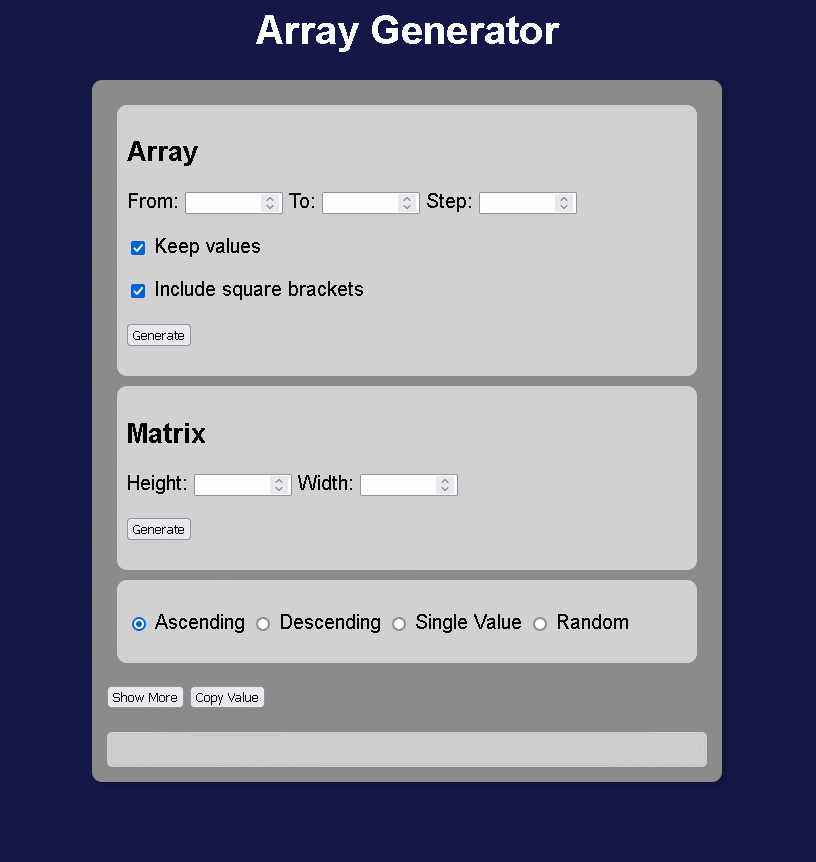
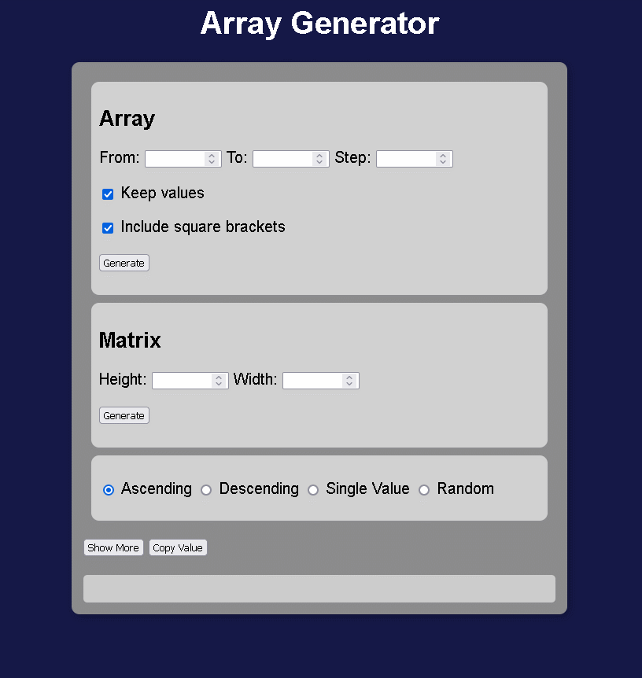

<h1 align="center">Array and Matrix Generator</h1>

## 💡 About
This is my first project using HTML, CSS and JavaScript. In this project I am working on a generator of customized arrays and matrices for tests of the most varied types.

- To test the project, [click here](https://cadu-fs.github.io/Array-Generator/interface.html).

## 🔨 Tools

- HTML
- CSS
- JavaScript

## 📝 How to use
### In the array section
> [!TIP]
> - From: Is the starting number of the array.
> - To: Is the final number of the array.
> - Step: Is the interval value between the numbers.
> - Keep values: Keep input numbers when generating.
> - Include square brackets: Include the brackets in the array.
> 

### In the matrix section
> [!TIP]
> - Height: Sets the number of rows in the matrix.
> - Width: Sets the number of columns in the matrix.
> 

### Last section
> [!TIP]
> - Ascending: Generates an increasing sequence.
> - Descending: Generates a descending sequence.
> - Single Value: Generates a single-valued string.
> - Random: Generates a random sequence.

## ⚙ Project status
### Bugs
- White bar above the result.

### Future features
- Generate letters and numbers.
- Receive custom inputs.

## 🔄 Version history
### 03/2024
  > - Added initial array and matrix capabilities.